<div align="center">

# Mug

Character mugs, catalogued and collected

[![Live][badge-site]][url-site]
[![HTML5][badge-html]][url-html]
[![CSS3][badge-css]][url-css]
[![JavaScript][badge-js]][url-js]
[![Claude Code][badge-claude]][url-claude]
[![License][badge-license]](LICENSE)

[badge-site]:    https://img.shields.io/badge/live_site-2563eb?style=for-the-badge&logo=googlechrome&logoColor=white
[badge-html]:    https://img.shields.io/badge/HTML5-E34F26?style=for-the-badge&logo=html5&logoColor=white
[badge-css]:     https://img.shields.io/badge/CSS3-1572B6?style=for-the-badge&logo=css3&logoColor=white
[badge-js]:      https://img.shields.io/badge/JavaScript-F7DF1E?style=for-the-badge&logo=javascript&logoColor=black
[badge-claude]:  https://img.shields.io/badge/Claude_Code-CC785C?style=for-the-badge&logo=anthropic&logoColor=white
[badge-license]: https://img.shields.io/badge/license-MIT-404040?style=for-the-badge

[url-site]:   https://mug.neorgon.com/
[url-html]:   #
[url-css]:    #
[url-js]:     #
[url-claude]: https://claude.ai/code

</div>

---

## Overview

Mug is a catalogue of collectible character mugs: 3D sculpted heads, shaped
bodies, bas relief, tiki and teapots, read from the makers' own shops. Collectors
keep a shelf of the mugs they own, want and once had, and can share it at their
own address. Every mug carries its capacity, style, maker, franchise and codes,
and links back to the shop it came from.

**Live:** mug.neorgon.com (not published yet: see [Going live](#going-live))

---

## Features

- **Catalogue** -- search, and filter by style, maker and franchise, sorted by newest, most collected or most wanted
- **A page per mug** -- gallery, a capacity gauge in ml or oz, material and care, SKU and barcode, the last price seen and where
- **Shelves** -- own, want or once had, with notes, condition, price paid and date; JSON export; delete everything in one step
- **Shared shelves** -- a public address at `/u/?handle`, closed until the deployment opens publishing
- **Community** -- anonymous totals always; collectors, recent additions and photos from shelves that chose to share
- **Collectors' photos** -- resized in the browser, checked by a person before they appear
- **An admin console** -- shop sources with robots and platform probes, scans on a schedule, a review queue that matches every listing to the catalogue, and three ways in: a shop URL, a paste from a marketplace page, or a form
- **A local runner** -- reads, from the owner's own connection, the pages a datacenter is refused, and never pretends to be a browser

---

## How the catalogue fills up

1. **A source** is one shop feed: five brand shops are read automatically
   (Shopify), and the rest are manual for reasons recorded in
   [`docs/sources.md`](docs/sources.md).
2. **A scan** runs on Convex's scheduler, one Worker call at a time, at least
   1.5 seconds apart per shop. The Worker reads robots.txt first, obeys it, and
   answers a normalised listing ([`docs/CONTRACTS.md`](docs/CONTRACTS.md) C1).
3. **Matching** decides whether a listing is new, a change at the shop, the same
   barcode from another shop (linked quietly), or merely similar (a person
   decides). Nothing reaches the catalogue until an admin approves it.
4. **Images** are mirrored into R2 by the Worker, keeping the address they came
   from. With no Worker configured, Convex stores them itself, as a last resort.
5. **What the cloud cannot read** goes to the runner queue; **Amazon** and shops
   whose robots.txt says no are never fetched, and enter by paste.

---

## Running locally

ES modules need an HTTP server (not `file://`). Four terminals, or background
three of them:

```bash
make install        # the Convex CLI, pinned (this folder is not a root npm workspace member)
make convex         # a LOCAL Convex deployment on 127.0.0.1:3210
make worker-install && make worker-dev   # the Worker on :8787, with a local R2
make serve          # the pages on http://localhost:8892
```

Then, once:

```bash
make dev-auth       # a dev sign-in key, trusted by the dev deployment only
make seed           # brands, sources, and six pasted examples to review
```

Open `http://localhost:8892/?convex=http://127.0.0.1:3210` and, to sign in as
the dev admin, add `&devtoken=$(make dev-token)`. The production Clerk key
refuses localhost, which is why dev sign-in exists; production never accepts
its tokens (CONTRACTS C9, A4, A7).

```bash
make validate       # every test, plain node, no install
```

---

## Architecture



```
mug-site/
├── _templates/        page.html plus one <main> per page; `make pages` writes the pages
├── index.html, mug/, brand/, community/, shelf/, u/, admin/, bot/   generated, never edited
├── css/style.css      the design (porcelain tiles, cobalt); css/admin.css for the console
├── js/                app.js picks a page module from <body data-page>; backend.js names every Convex call
├── shared/            the listing contract and every extractor, used by all of the below
├── convex/            schema, tested cores in lib/, functions, the runner's HTTP endpoints
├── worker/            mug-proxy: probe, discover, extract, images, and GET /i/<key>
├── runner/            the local runner (Node, no dependencies)
├── tests/             node --test, including an in-memory Convex that parses the real schema
└── docs/              CONTRACTS.md, sources.md, architecture.mmd and .svg
```

---

## Going live

The owner's steps, in the order the platform needs them.

1. **The Worker.** In `worker/`: `npx wrangler r2 bucket create mug-images`,
   then `npx wrangler secret put MUG_PROXY_TOKEN` (a long random value), then
   `npx wrangler deploy`. Note its URL.
2. **Convex production.** Run `npx convex deploy`. The first deploy stops on
   `MUG_DEV_JWKS` (CONTRACTS A7). Then set:

   ```bash
   npx convex env set --prod MUG_DEV_JWKS off
   npx convex env set --prod ADMIN_SUBJECTS <your Clerk user id>
   npx convex env set --prod MUG_PROXY_URL <the Worker URL>
   npx convex env set --prod MUG_PROXY_TOKEN <the same value>
   ```

   Deploy again, then run `npx convex run --prod seed:sources`. Leave
   `PUBLISHING` unset until shared shelves should open.
3. **Images off the Worker (optional, recommended).** Give the R2 bucket a custom
   domain and set `MUG_IMAGES_BASE` to it. This takes image traffic off the
   Worker's free 100,000 requests a day. The only zone available is
   `neorgon.org`, the CDN's, so this is your call.
4. **The pages.** Put the production URL in `CONVEX_URL` in `scripts/pages.py`,
   run `make pages`, and commit.
5. **Publish.** Follow `docs/operations/publishing.md` in the monorepo: create
   the repo, Pages on `mug.neorgon.com` (the `CNAME` is already here), then the
   DNS record.

---

## Data and courtesy

Mug keeps facts, not marketing copy: a shop's own description is kept for the
admin's reference and never published. Every image keeps its source address,
every mug links to its shop, and [the MugBot page](bot/index.html) tells shop
owners how to opt out or ask for a correction.

---

<div align="center">
<sub>Part of <a href="https://neorgon.com/">Neorgon</a></sub>
</div>
